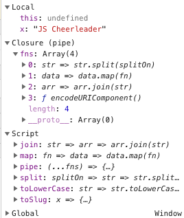

# Function Composition With Pipe & Compose

[Source](https://medium.com/javascript-scene/master-the-javascript-interview-what-is-function-composition-20dfb109a1a0)

* First of all we need to define the pipe function that will take other functions as arguments. ´pipe()` due to the fact that `pipe()` takes other functions as arguments it's a higher order function.

```js
const pipe = (...fns) = x => fns.reduce((v, f) => f(v), x)
``` 

* Now we need to define functions that will be part of the data pipeline, means they will be part of arguments of `pipe()`

```js
const split = splitOn => str => str.split(splitOn)
const map = fn => data => data.map(fn)
const join = str => arr => arr.join(str)
const toLowerCase = str => str.toLowerCase()
``` 

* All of this functions are curried. A curried function is a function with more than one argument that can be made into a sequence of functions that can be executed. You apply currying while you design the functions.

* You can use libraries to create a curried funtion out of a normal function e.g.

```js
const R = require('ramda')

const split = (splitOn, str) => str.split(splitOn)
const mapping = (fn, data) => data.map(fn)
const joining = (str, arr) => arr.join(str)
const toLowerCase = str => str.toLowerCase()

const toSlug = R.pipe(
    R.curry(split)(' '),
    R.curry(mapping)(toLowerCase),
    R.curry(joining)('-'),
    encodeURIComponent
)

console.log(toSlug('Dimitri Tarasowski')) // dimitri-tarasowski
``` 

* There is also another method without making a curried funtion from a normal function. The method is called `R.partial()`, where you can partially apply the arguments.

```js
const R = require('ramda')

const split = (splitOn, str) => str.split(splitOn)
const mapping = (fn, data) => data.map(fn)
const joining = (str, arr) => arr.join(str)
const toLowerCase = str => str.toLowerCase()

const toSlug = R.pipe(
    R.partial(split, [' ']),
    R.partial(mapping, [toLowerCase]),
    R.partial(joining, ['-']),
    encodeURIComponent
)

console.log(toSlug('Dimitri Tarasowski')) // dimitri-tarasowski
``` 
* Let's get back to the original example, now we can use the `pipe()` function or create a data pipeline.

```js
const pipe = (...fns) => x => fns.reduce((v, f) => f(v), x)

const split = splitOn => str => str.split(splitOn)
const map = fn => data => data.map(fn)
const join = str => arr => arr.join(str)
const toLowerCase = str => str.toLowerCase()

const toSlug = pipe(
            split(' '),
            map(toLowerCase),
            join('-'),
            encodeURIComponent,
        )

toSlug('Dimitri Tarasowski')
``` 
* Here is exactly what happens here:

1. We declare a variable pipe and assign a function to it.
2. We declare a variable split and assign a function to it.
3. We declare a variable map and assign a function to it.
4. We declare a varaible join and assign a function to it.
5. We declare a variable toLowerCase and assign a function to it.
6. We declare a variable toSlug which is undefined, but at the same time a new local execution context gets opened `pipe()`
7. Now the parameters get set (parameterization), basically it means each argument gets assigned to a variable, since we are using rest & destructuring all parameters will be gathered into an array. Important: `split(), map(), join()` function gets executed, means they all open new local execution environments. Each function returns another function, since they all are curried, the returned functions are closures, they can now access variable in the outer scope. After all local execution contexts are closed the variable `toSlug` gets assigned a value as a function that is returned from `pipe()`. In this case `pipe()` returns another function.
8. We are calling the `toSlug('Dimitri Tarasowski')` function a new local execution context gets created, the `toSlug()` function is called by adding an argument we supply the first parameter to that function. Now all the function inside the `pipe()` are called each after each other, where the argument of `toSlug('Dimitri Tarasowski')` is expected input for the functions inside the `pipe()`. After all function has been run we return a transformed value back to the caller in this case back to the global execution environment and get process gets shutdown.

* This is how the closure of pipe looks like




