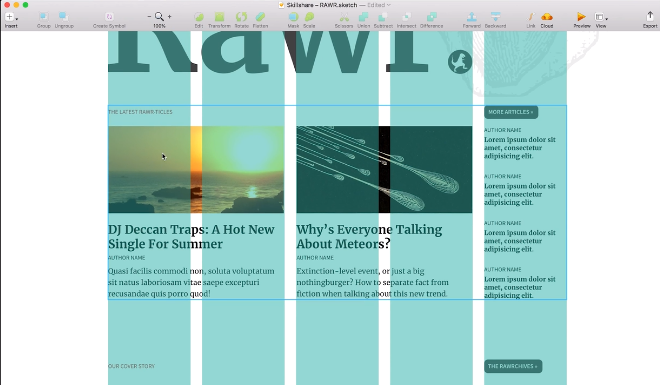

# Responsive Web Design: Creating Flexible Websites That Last

[Source](https://www.skillshare.com/classes/Responsive-Web-Design-Creating-Flexible-Websites-That-Last/440884573/reviews)


## What is responsive design?

* When we designing for the web, the web is everywhere. Web is completely flexible design medium.

> When we design for the web, we're designing for an infinite canvas. Our designs needs to be flexible as devices there are.

* When you change the size the content changes too.

* We should stop designing for individual devices, we should design for readers. The design should be flexible everywhere.

> With responsive design all devices receive the same experience. You are designing for one flexible experience. (It just might look differently)

1) Fluid grid (a layout build with percentages with proportions)
2) Flexible images
3) Media queries (create layouts that change the shape)

> A responsive layout is flexible in nature, but changes and adapts at certain breakpoints. 

## Creating Fluid Grids (The foundation of responsive design)

> Every responsive design begins with a flexible foundation.

1) He started to makring up the text. He created blocks such as `<main>`, `<section>`, `<header>`, `<article>` and so on. 

2) Then he applyed some simple styling to HTML elements such as colors, font-sizes. There are no images.
  - He tries to focus on the content and the layout for the first section

3) Now you need to x-ray the layout for the grid e.g. a 5 column grid in the example below. It's needed so you know how translate it into HTML and CSS by using CSS Grid.


**Important:** You need to focus on one section that you want to implement. In this case he focuses on the recent articles section.



```html
<section>
        <div class="articles-recent">
            <header>
                <h2 class="hed hed-section">The Latest Rawr-ticles</h2>

                <a class="more" href="#">More Articles</a>
            </header>

            <article class="story story-lead">
                <h2 class="hed"><a href="#">The Deccan Traps: This Year’s Hot New Summer Getaway</a></h2>
                <p class="meta"><a href="#"><cite>Terry Don</cite></a></p>
                <p>Learn more about this steamy getaway, and plan your next vacation. You won’t beat the heat, but this locale will have your cares melting away in no time.</p>
            </article>

            <article class="story story-alt">
                <h2 class="hed"><a href="#">Why’s Everyone Talking About Meteors?</a></h2>
                <p class="meta"><a href="#"><cite>Mike Ceratops</cite></a></p>
                <p>Extinction-level event, or just a big nothingburger? How to separate fact from fiction when talking about sky rocks.</p>
            </article>

            <aside>
                <ol class="teaser-list">
                    <li>
                        <article class="teaser-item">
                            <h3 class="hed"><a href="#">Lorem ipsum dolor sit amet, consectetur adipisicing elit.</a></h3>
                            <p class="meta"><span class="a11y">by</span> Author Name</p>
                        </article>
                    </li>
                    <li>
                        <article class="teaser-item">
                            <h3 class="hed"><a href="#">Lorem ipsum dolor sit amet, consectetur adipisicing elit.</a></h3>
                            <p class="meta"><span class="a11y">by</span> Author Name</p>
                        </article>
                    </li>
                    <li>
                        <article class="teaser-item">
                            <h3 class="hed"><a href="#">Lorem ipsum dolor sit amet, consectetur adipisicing elit.</a></h3>
                            <p class="meta"><span class="a11y">by</span> Author Name</p>
                        </article>
                    </li>
                    <li>
                        <article class="teaser-item">
                            <h3 class="hed"><a href="#">Lorem ipsum dolor sit amet, consectetur adipisicing elit.</a></h3>
                            <p class="meta"><span class="a11y">by</span> Author Name</p>
                        </article>
                    </li>
                </ol>
            </aside>
        </div><!-- /end .articles-recent -->
    </section>
``` 


