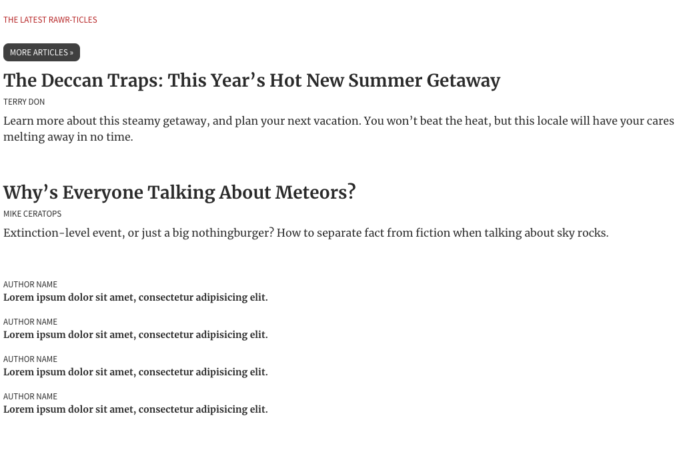
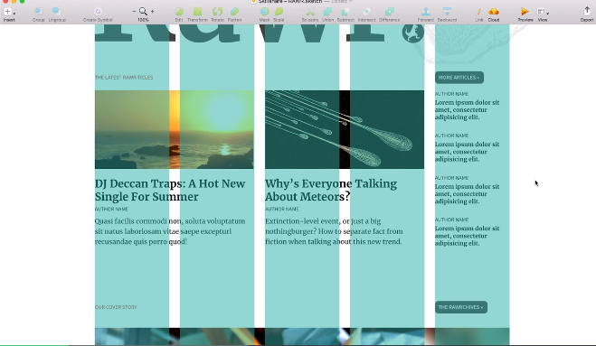
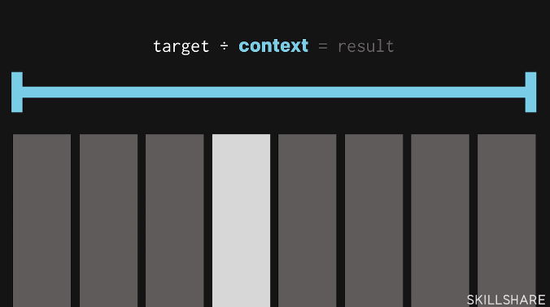

# Responsive Web Design: Creating Flexible Websites That Last

[Source](https://www.skillshare.com/classes/Responsive-Web-Design-Creating-Flexible-Websites-That-Last/440884573/reviews)


## What is responsive design?

* When we designing for the web, the web is everywhere. Web is completely flexible design medium.

> When we design for the web, we're designing for an infinite canvas. Our designs needs to be flexible as devices there are.

* When you change the size the content changes too.

* We should stop designing for individual devices, we should design for readers. The design should be flexible everywhere.

> With responsive design all devices receive the same experience. You are designing for one flexible experience. (It just might look differently)

1) Fluid grid (a layout build with percentages with proportions)
2) Flexible images
3) Media queries (create layouts that change the shape)

> A responsive layout is flexible in nature, but changes and adapts at certain breakpoints. 

## Creating Fluid Grids (The foundation of responsive design)

> Every responsive design begins with a flexible foundation.

1) He analyses the structure of the content and translates it into markup. He created blocks such as `<main>`, `<section>`, `<header>`, `<article>` and so on. **Important:** No images focus on the content. 


```html
<section>
  <div class="recent articles">
    <header>
        <h2>The Latest Rawr-ticles</h2>
        <a href="#">More Articles</a>
    </header>
    <article class="story story-lead">
      <h2></h2>
      <p><a href="#"></a></p>
      <p></p>
    </article>
    <article class="story story-alt">
      <h2></h2>
      <p><a href="#"></a></p>
      <p></p>
    </article>
    <aside>
      <ol>
        <li><a href="#"></a></li>
      </ol>
    </aside> 
  </div>
</section>
``` 
---

2) Then he applyed some simple styling to HTML elements such as colors, font-sizes. There are still no images. We don't have a layout but have some simple styles uplied to the markup from the step 1.



---

3) Now you need to x-ray the layout for the grid e.g. a 5 column grid in the example below. Now you are starting to translate your markup into a layout with CSS grids.



**Important:** Don't use pixels to translate the layout into code. But the problem with pixels is that they don't really change their shape. If you resize the browser to see how it looks on mobile, it's not going to be adapted to the screen. You can use a formula to translate something from a fixed layout into something more proportional. You can use the formula `taget / context = result` 



---


