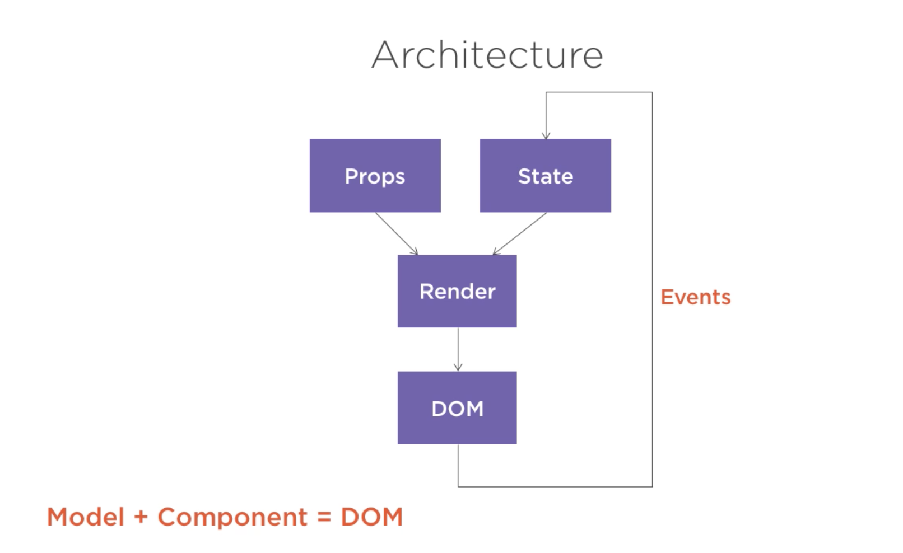
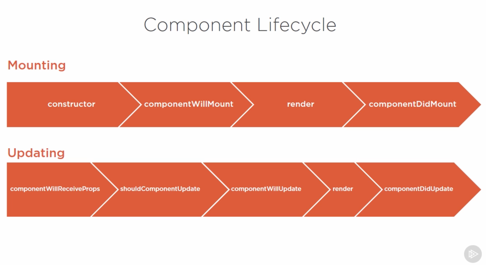

# React.js: Getting Started

[Source](https://app.pluralsight.com/library/courses/react-js-getting-started/table-of-contents)

* React is JS library and not a framework. React is small and not a complete solution, we often need to use more libs to use with React. It focuses only on UI. 

* React is building UI's. React is declarative, we describe UI's and tell it what we want not how to do it. React will take of the how and translate the declarative description. 

* 3 main design concepts:

1. Component: we desribe user interfaces using components. Components are simple functions. Input / output. We call the input properties and state and the component's output is the description of the the user interface. We can reuse components and components can contain other components. A component can hold a private state. 

2. Reactive updates: when the state of the component (the input) changes the user interface that presents the output changes as well. Since the components act as a function. React will simply react to the changes and update the output.

3. Virtual views in memory: Write HTML in Javascript. Virtual DOM. React writes only the difference to DOM. Not renders the whole DOM.

* React component can be a function or class component. 

1. A function component: It receives an object with properties. It's called props in react and returns what looks like an HTML, but it's JSX
```jsx
const MyComponent = (props) => {
    return (<elementOrComponent />)
}
```

2. A class component: is more featured way to define a React component. It also acts like a function that receives props, but that function also has a private state (STATE) as additional input that returns JSX. This private internal state is what gives react this reactive nature. If a class component changes react will automatically re-render that component. 

```jsx
class MyComponent extends React.Component {
    render() {
        return (<elementOrComponent />)
    }
}
```

* Note: State and props have one important difference. State can be changed, while props are all fixed values. Class components can change only their internal state not their properties. 

* Props is an object that holds all the values when the component was rendered. Component properties are immutable. The example below is a function component, function component cannot have state. 

```jsx
const Button = (props) => {
return (<button>{props.label}</button>)
}

ReactDOM.render(<Button label= 'Hello'/>, mountNode)
``` 

* The `render()` function returns the component (JSX).


* In the example below the `this` refers to the component itself. 
```jsx

class Button extends React.Component {
constructor (props) {
super(props)
this.state = {counter: 19}
}
render() {
	return (<button>{this.state.counter}</button>)
}
}

ReactDOM.render(<Button />, mountNode)
``` 

* The state of the component can be only accessed by that component itself. No other component can access the state of the component. In order to make it accesssible we need to hold both components together. 

```jsx

class Button extends React.Component {
//state = {counter: 0}
handleClick = () => {
	this.props.onClickFunction(this.props.incrementValue)
}
render() {
	return (<button onClick={this.handleClick}>
  +{this.props.incrementValue}
  </button>)
}
}

const Result = (props) => {
return (
	<div>{props.counter}</div>
)
}

class App extends React.Component {
state = {counter: 0}
incrementCounter = (incrementValue) => {
	// this === component instance
  this.setState((prevState) => ({
  	counter: prevState.counter + incrementValue
  }))
}
render() {
	return (
  <div>
  <Button incrementValue={1} onClickFunction={this.incrementCounter}/>
  <Button incrementValue={5} onClickFunction={this.incrementCounter}/>
  <Button incrementValue={10} onClickFunction={this.incrementCounter}/>
  <Button incrementValue={100} onClickFunction={this.incrementCounter}/>
  <Result counter={this.state.counter}/>
  </div>
  )
}
}

ReactDOM.render(<App />, mountNode)

``` 

**Note:** Rendering is the convertion of data that describes the state of the user interface into document object model object that the browser can use to produce a user interface that the user can see and interact with. 

**Note:** Event handling lets the programmer detect when the user interacts with their program and to specify how the program should response.

* A react component is a function that converts a model object into a piece of user interace. 

* React is a library and not a framework. To build complex applications you will likely need to add a router, managing state changes, validation, form support etc. You can assemble a system you want!

* As much as possible you should use component that don’t have state. Because they are simple. The flow of data always in the same direction from the model to the render to the DOM. The DOM is the direct result of rendering: Model + Component = DOM

* The way to change the DOM, you need to change the model (data). Once the DOM has been rendered it can generate events which feeds back into the component state that triggers another render cycle

* For any state change react will regenerate the component and child components. It will update the virtual DOM and regenerate the real DOM



* React only handles the UI and reacts to events! Nothing else, if you need to do other stuff you need to use other libraries. 

* React uses plain Javascript for view logic.

* Components are orgnised in a tree of components. 

* Components are the fundamental uni of a react application. Each component corresponds to an element in the DOM. The component is responsible for rendering of the content of the element and for handling any events that occur within it. 

* Components can be nested inside other components. It’s called composing components and it’s a powerful technique achieving reuse. Such components correspond to nested DOM nodes.  

* Elements that represents the DOM tags are written in a lower case. 

* User defined elements such as functions / classes must start with a capital letter. Attributes on user defined elements are passed to the user component as an object.

> “All react components must act like a pure functions with respect to their props. For a given props object the output should be the same. This allows react to optimize rendering, if the props have not changes then component doesn’t need to be rerendered. Theh output should be the same”

* Component lifecycle method are useful when you want to wrap an impirivite API e.g. you may creating a component for jquery plugin, you would use component lifecycle to initialize jquery and possibly remove it when it’s no longer required.



* State is local, mutable data and can be created within a component. State increases the complexity and composability of the component. As such you should avoid using state as possbile!

* You need to use `setState()` method that react knows that the state has changed and the components needs to be rerendered. Avoid class components and state whenever possible. The `setState()` method merges the new state with the old state. Previous state remains unless it’s overwritten. For performance reasons `setState()` calls are batched, there is no guarantee that state change will occur immediately. 

* JSX is an external domain specific language. That is optimized to generate XML like documents. The web application markup language is HTML and HTML is XML like. For React application JSX is used to generate HTML, but it also supports custom react components. JSX compiles to JavaScript!

* JSX allows us to include XML like syntax in JavaScript. React uses JSX to describe the composition of React Components in a readable way. 

* The JSX transformer pre-processes JSX and converts each element into a Javascript function call.

* JSX is a syntax that is used inline in JSX files and that is converted by Babel into regular JavaScript


* When a component is combined with some props it’s called a REACT ELEMENT!!!
```jsx
<Sum a={4} b={10} />
```

equals to

```js
React.createElement(
	Sum,
	{a: 4, b: 10},
	null
)
``` 

* Anther example with nested elements

```jsx
<h1>
	<Sum a={4} b={10} />
</h1>
```

equals to 

```js
React.createElement(
	‘h1’,
	null,
	React.createElement(
		Sum,
		{a: 4, b: 10},
		null
	)
)
```

**Note:** In above example the `React.createElement()` is passed a a third argument, because it’s a child of `<h1>`. 

* In JSX we can use spread attributes. Instead of defining each prop, we can simply use the spread attributes, see example below.

```js
const props = {a: 4, b: 10}
const element = <Sum {…props} />
```

* React data flow. Data is passed down to the hierarchy by passing values into component propes. Data is passed back up the component hierarchy by passing as function arguments by functions passed in that props.

* This is how JSX compiles to HTML

```jsx
<label 
	htmlFor=‘name’
	className=‘highlight’
	style={{ backgroundColor: ‘yello’ }}
>
Foo Bar
</label
```

equal to

```html
<label
	for=“name”
	class=“highlight”
	style=“background-color: yellow”
>
Foo Bar
</label>
```

* JSX is hierarchical so any valid JSX expression maybe a child of other JSX expressions. You can have many of the JSX expressions and elements within a single JSX component. JSX elements can be nested

```jsx
<Hello>
	<First />
	<Second />
</Hello>
```

* Within a compoent you can reference it’s child element via special propery `props.children`. This means we can create component to wrap other componenents. We can e.g. create a component that controls the visibilty of the children. Anything within this component can be shown or hidden.

```jsx
<ConditionalDisplay isVisible={state.showSum}>
	<h1>A <span>Sum</span></h1>
	<Sum a={4} b={2}
</ConditionalDisplay>
```

```jsx
const ConditionalDisplay = (props) => {
return (
	<div>{props.isVisible ? props.children : null}</div>
)
```


